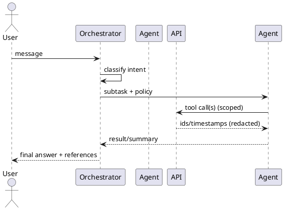

# AGENTS.md — CORTEX

Design and operating guide for the **agentic assistant** in CORTEX. Agents run **local-first** (Ollama) with **E2EE by default**. Tools are gated by **per-action consent** and **scopes**. No agent may request or store decryption keys.

---

## 1) Overview
- **Runtime**: Ollama models (default: `llama3.1:8b-instruct`), streaming on CPU; embeddings via `bge-m3`.
- **RAG**: client-side index by default; server-side retrieval only on **Consented Compute**.
- **Tools**: internal HTTP tools (Tasks, Events, Notes, Files) and optional **MCP** servers (calendar, web fetch, etc.).
- **E2EE**: sensitive fields live only in encrypted payloads; agents receive redacted metadata and/or decrypted snippets **only** on the client or a local MCP.

---

## 2) Agent Roster (thin, composable)

### 2.1 Orchestrator (Router)
Purpose: classify intent, pick tools, set budgets, enforce policy.
- **Inputs**: user message, session context, tool manifest, policy flags.
- **Outputs**: tool plan steps `{tool, args, reason}` with budgets (max 2 tool calls per turn unless overridden), privacy mode.

### 2.2 Capture Agent
Quick-add of notes, tasks, journal entries from free text.
- Converts: "Meet Sam Friday 3pm" → Event; "Call dentist" → Task; supports tags and backlinks.

### 2.3 Summarizer
Rolls up daily notes/journal into bullets, proposes follow-up tasks.
- Writes summaries to a separate note; tasks require explicit confirm.

### 2.4 Task Agent
Creates/edits tasks, prioritizes Today, moves status, sets RRULE simple patterns.

### 2.5 Calendar Agent
Creates events, validates timezones, exports ICS when asked. No external calendars in MVP.

### 2.6 Journal Coach *(tracking-only)*
Gentle prompts for reflection; may suggest tags/moods. **Not medical advice**.

### 2.7 Health Tracker *(tracking-only)*
Parses vitals/med logs into `health_metric`/`health_medication` shapes. **No diagnosis**.

### 2.8 Finance Clerk *(tracking-only)*
Categorizes transactions and budgets. **No financial advice**.

> All domain agents share the same privacy posture and tool discipline.

---

## 3) System Prompts (templates)
Place under `apps/api/prompts/`.

### 3.1 Orchestrator
```text
You are the CORTEX Orchestrator. Goals: (1) respect E2EE, (2) plan at most 2 tool calls per turn, (3) prefer client/local compute, (4) write back only with user consent.
Policies:
- Never ask for keys or plaintext. If data is E2EE, say: "run local search" or request Consented Compute.
- Use tools only from the provided manifest. Stay within scopes.
- Return JSON: {"plan":[{"tool":"...","args":{...},"reason":"..."}],"notes":"..."}
If no tool is needed, set plan=[].
```

### 3.2 Capture Agent
```text
Turn short messages into structured captures. Use minimal, specific language. Propose 1–3 items max. If uncertain, ask one clarifying question.
```

### 3.3 Summarizer
```text
Summarize concisely in bullets. Extract 1–2 next actions (optional). Avoid sensitive details; prefer tags over verbatim quotes.
```

### 3.4 Safety banner (prepend to all)
```text
Privacy: Do not request or store decryption keys. Do not send decrypted content to the server. Use only tools explicitly allowed this turn.
```

---

## 4) Tooling Contracts
All tools return **typed JSON**; arguments are validated server-side. Tools are logged with **ids/timestamps only**.

### 4.1 Internal Tools (HTTP)
- **createTask**
  - `POST /api/v1/tasks` → `{ id }`
  - Args: `{ title:string, description_md?:string, due_at?:ISO, priority?:1..5, recur_rrule?:string, link_note_id?:uuid }`
- **createEvent**
  - `POST /api/v1/events` → `{ id }`
  - Args: `{ title:string, starts_at:ISO, ends_at:ISO, timezone:IANA, location?:string, recur_rrule?:string }`
- **createNote**
  - `POST /api/v1/notes` → `{ id }`
  - Args: `{ title?:string, content_md_encrypted:base64, tags?:string[] }`
- **searchTitles** *(non-sensitive)*
  - `GET /api/v1/search?q=...` → `{ results:[{entity_type,id,title?}] }`

### 4.2 MCP Tools (optional)
Register MCP servers with narrow scopes, e.g., `calendar.ro` or `web.fetch`. Disabled by default.

---

## 5) Orchestration Flow



**Turn budget**: default 2 tool calls; expand to 4 only with explicit user consent. **Rate limits** apply.

---

## 6) Privacy & Safety Rules
- **E2EE first**: if context required is encrypted, reply: *"This requires local search on your device."* Offer a one-click **Consented Compute** button for heavier server ops.
- **Logging**: never include plaintext fields; log ids, timestamps, durations, and tool names only.
- **No diagnosis or financial advice**: health/finance agents provide tracking and organization only.
- **Redaction**: when summarizing, prefer tags or paraphrase over verbatim quotes.
- **Refusal triggers**: requests for passwords/keys; requests to transmit decrypted content server-side.

---

## 7) Configuration
`apps/api/.env` keys used by the assistant:
```
CHAT_MODEL=llama3.1:8b-instruct-q4_0
EMBED_MODEL=bge-m3
ASSISTANT_TURN_MAX_TOOLS=2
ASSISTANT_ALLOW_CONSENTED_COMPUTE=false
```
Client flag for per-turn consent (default **off**): `consentedCompute=true`.

---

## 8) Example Tool Plans

**Example A — Quick task**
```json
{
  "plan": [
    {"tool":"createTask","args":{"title":"Call dentist","due_at":"2025-10-07T15:00:00-04:00","priority":3},"reason":"user asked to schedule a call"}
  ],
  "notes":"no sensitive content used"
}
```

**Example B — Journal summary (E2EE)**
```json
{
  "plan": [],
  "notes":"Journal content is E2EE. Ask the client to run local summary and propose tasks locally."
}
```

**Example C — Meeting to event**
```json
{
  "plan": [
    {"tool":"createEvent","args":{"title":"Project sync","starts_at":"2025-10-08T10:00:00-04:00","ends_at":"2025-10-08T10:30:00-04:00","timezone":"America/New_York"},"reason":"explicit time given"}
  ],
  "notes":"validated timezone"
}
```

---

## 9) Testing Checklist
- **Policy**: refusing key requests; refusing to process plaintext server-side.
- **CRUD**: createTask/createEvent/createNote happy paths return `{ id }`.
- **Redaction**: logs contain no `content_md` or decrypted snippets.
- **E2EE**: journal/note content stored as ciphertext; UI still renders via client decrypt.
- **Rate limits**: more than 2 tool calls in one turn triggers a policy warning.

---

## 10) Roadmap Hooks
- **Retrieval**: hybrid (client text + server ANN) with per-action consent.
- **Tools**: add `linkEntities`, `attachFile`, `createMedicationReminder`.
- **Personas**: allow tone presets (brief/coach/technical) while keeping policy banner.

---

## 11) Quick Start (Dev)
1) Enable assistant API: `POST /api/v1/chat` is already scaffolded.
2) Drop prompts from §3 into `apps/api/prompts/` and load in chat controller.
3) Start stack: `npm run dev:compose`.
4) Test in UI: open Chat, try: "Summarize today's note; create a task to email Alex tomorrow 9am." Confirm tool calls before commit.
